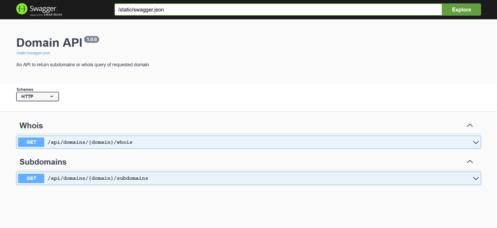

# Domain Monitor



You can test the web app using docker:

```
docker-compose up -d
```

And go to http://127.0.0.1.

## API Endpoints

### Whois query

> /api/domains/{domain}/whois

#### Query Strings:

- fields: What fields of the whois query the api will return. Should be separated by commas.
  Example: registrar,creation_date,expiration_date

### Subdomain query

> /api/domains/{domain}/subdomains
